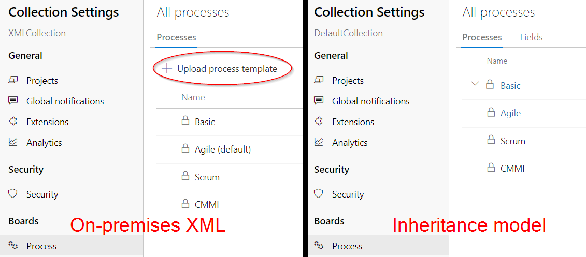
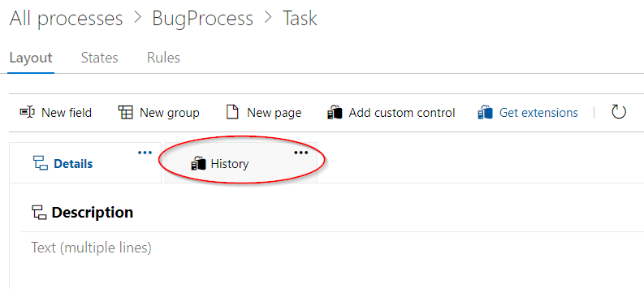

# Azure DevOps History Diff <!-- omit in toc -->

[](https://marketplace.visualstudio.com/items?itemName=Sedenion.HistoryDiff)
[](https://marketplace.visualstudio.com/items?itemName=Sedenion.HistoryDiff)


- [Introduction](#introduction)
- [Basic installation and requirements](#basic-installation-and-requirements)
- [Details about the new "History" tab](#details-about-the-new-history-tab)
  - [Basic functionality](#basic-functionality)
  - [Filters](#filters)
- [On-premise installation (Azure DevOps Server)](#on-premise-installation-azure-devops-server)
  - [Uploading the extension to Azure DevOps Server](#uploading-the-extension-to-azure-devops-server)
  - [Enabling/configuring the history tab for work item types](#enablingconfiguring-the-history-tab-for-work-item-types)
    - [Installation for the "Inheritance" process model](#installation-for-the-inheritance-process-model)
    - [Installation for the "On-premises XML" process model](#installation-for-the-on-premises-xml-process-model)
- [Cloud installation (Azure DevOps Services)](#cloud-installation-azure-devops-services)
  - [Installation for the "Inheritance" process model](#installation-for-the-inheritance-process-model-1)
  - [Installation for the "Hosted XML" process model](#installation-for-the-hosted-xml-process-model)
- [Future ideas](#future-ideas)


# Introduction

The standard history tab of work items in Azure DevOps (ADO) shows only the entire old and new values of each field, without highlighting the actual changes within it.
This makes spotting the difference very hard for fields that usually contain a lot of text; most prominently, the standard "Description" and "Repro Steps" fields as well as the comments.
This extension adds a **new tab** to work items that shows the full history of every field, while computing an **appropriate diff** for each one. Optionally, the user can filter out uninteresting fields (e.g. related to work logging).


**If you like the extension, please give it a [star on GitHub](https://github.com/Sedeniono/ADO-History-Diff) and rate on the [Visual Studio marketplace](https://marketplace.visualstudio.com/items?itemName=Sedenion.HistoryDiff)!**

The left image shows the default ADO history, while the right depicts the history as shown by the extension:
Changes to the text are much easier to spot.


# Basic installation and requirements
**Installation:**
* Via the [Microsoft marketplace](https://marketplace.visualstudio.com/items?itemName=Sedenion.HistoryDiff).
* If you are using the on-premise Azure DevOps Server, you can also download the extension's vsix package from the [releases here on GitHub](https://github.com/Sedeniono/ADO-History-Diff/releases) and install it directly without using the marketplace.

Please see the chapters further down for more details on how to install the extension.


**Requirements:**
* Azure DevOps:
  * On-premise: [Azure DevOps Server](https://azure.microsoft.com/en-us/products/devops/server) 2019, 2020 or 2022. (Tested with 2019.1.2, 2020.1.2 and 2022.1.)
  * Also supports the cloud variation [Azure DevOps Services](https://azure.microsoft.com/en-us/products/devops)
* Users should use a reasonably recent browser (year >2020). Tested with Edge, Chrome and Firefox.


**Change log:**  
For release notes, please visit the [releases page](https://github.com/Sedeniono/ADO-History-Diff/releases).


**Building it yourself:**  
If you want to build the vsix package yourself (also compare the [official Microsoft documentation](https://learn.microsoft.com/en-us/azure/devops/extend/get-started/node)):
* Get the source code from the [extension's GitHub repository](https://github.com/Sedeniono/ADO-History-Diff).
* Execute `npm install -g tfx-cli` somewhere to install the extension packaging tool (TFX) globally.
* In the code's main directory, execute:
  * `npm ci` to get the dependencies.
  * `npm run build` to create the vsix package (optimized release version) or `npm run build-dev` (non-optimized development version).


**Inspecting the vsix package:**  
If you want to inspect the contents of the vsix package e.g. for security auditing purposes, it can be extracted using tools such as [7-zip](https://www.7-zip.org/).
Note that the html and javascript files have been minimized and merged via [webpack](https://webpack.js.org/) to improve loading times.
So I suggest to read the original source from the [GitHub repository](https://github.com/Sedeniono/ADO-History-Diff) instead.
You can then build the vsix package yourself (`npm run build`, see above) and verify that the content of your manually produced vsix package is the same as in the released vsix package (from the marketplace or GitHub releases page).


# Details about the new "History" tab

## Basic functionality
The extension adds a new tab called "History" on the work item form.
It does **not** modify the existing ADO history page because this is not possible with an extension to the best of my knowledge.

When opening the new "History" tab, the extension gets all previous changes of the work item and the comment history via the Azure DevOps REST API.
For HTML-based fields (e.g. the "Description" field, comments, or custom fields of type "Text (multiple lines)"), the extension uses [htmldiff](https://www.npmjs.com/package/node-htmldiff) to compute a diff that is aware of HTML elements.
String fields are diffed as ordinary strings (actually, using the same library, but with special characters escaped).
For all other field types, computing a diff makes no sense and the entire old and new values are shown directly.
The extension also shows the comments of new relations/links, but only the newest version of the comment text. ADO does not provide an API to query the history of relation/link comments (in contrast to the work item comments).

Removed/old fragments are highlighted with a red background, new fragments with a green background.
The extension is aware of the dark mode theme and uses appropriate colors.
Note: Changing the theme in Azure DevOps (light to dark or vice versa) might not immediately change all colors. The page should be reloaded after changing the theme.

## Filters
Using the "Filters" button in the top right corner of the history tab, users can filter out fields that are uninteresting to them, such as work logging related fields or fields used by scripts for housekeeping purposes.
The field names as shown in the history are matched completely by default and case-insensitively.
Note that a `*` wildcard can be used to match any number of arbitrary characters.
For example, `description`, `Desc*`, `*SCRIPT*` and `*tion` will all match e.g. the field `Description`.
To make entering fields easier, the fields of the currently active work item can be selected from a dropdown (Edge and Chrome show a dropdown button directly, Firefox users need to double click or use the arrow keys to show it).

The configuration dialog also allows to disable all configured filters without deleting them; the intention is to allow the user to temporarily view the full history without loosing the configured filters.

All settings are stored per user on the server using [ADO's data storage facilities](https://learn.microsoft.com/en-us/azure/devops/extend/develop/data-storage).


# On-premise installation (Azure DevOps Server)

## Uploading the extension to Azure DevOps Server

See the [official Microsoft documentation](https://learn.microsoft.com/en-us/azure/devops/marketplace/install-extension?view=azure-devops-2022). In short, you have to options:
1. Option 1: Direct installation from the marketplace.  
   In the web interface of your Azure DevOps Server, go to `Collection Settings` &rarr; `Extensions` &rarr; `Browse marketplace` (in the top right corner) &rarr; search for "Sedenion.HistoryDiff" to find the extension and click on it &rarr; `Get it free` &rarr; select the target collection from the drop down list &rarr; hit `Install` &rarr; `Proceed to collection`.
2. Option 2: Manual upload of the vsix package.
   1. Download the vsix package either from the [Microsoft marketplace](https://marketplace.visualstudio.com/items?itemName=Sedenion.HistoryDiff) or the [releases here on GitHub](https://github.com/Sedeniono/ADO-History-Diff/releases).
   Both host identical files.
   Then in the web interface of your Azure DevOps Server, go to `Collection Settings` &rarr; `Extensions` &rarr; `Browse local extensions` (in the top right corner) &rarr; scroll down and select `Manage extensions` &rarr; then `Upload extension` (top right corner).

   2. Afterwards, on the `Browse local extensions` page, the `History Diff` extension should have appeared. Click on it &rarr; `Get it free` &rarr; select the target collection from the drop down list &rarr; hit `Install` &rarr; `Proceed to collection`.
   
   
You need to do this once per collection.
Also, simply uploading the extension is not enough if you use the "On-premises XML" process model. See the next chapters for more information.


## Enabling/configuring the history tab for work item types
The next steps depend on the process model your ADO collection employs.
There are [three process models](https://learn.microsoft.com/en-us/azure/devops/reference/customize-work?view=azure-devops-2022#collection-level-process-customization) in ADO: 
* The "Inheritance" model, which allows to configure work items in the web frontend. This is the default for new collections in Azure DevOps Server. It is also the only choice in Azure DevOps Services (apart from organizations that used the data migration tool).
* The "On-premises XML" model, which uses the [`witadmin` tool](https://learn.microsoft.com/en-us/azure/devops/reference/witadmin/witadmin-customize-and-manage-objects-for-tracking-work?view=azure-devops-2022) to perform the configuration. 
* The "Hosted XML" model, which applies only to the cloud variation "Azure DevOps Services", but not the on-premise Azure DevOps Server. It is only available for organizations that used the data migration tool.


If you are unsure which process model your on-premise installation for Azure DevOps Server employs:
In the web frontend of ADO, go to `Collection Settings` &rarr; `Process`. 
If you see the `Upload process template` button below the "All processes" and "Processes" texts, you are using the "On-premises XML" process model, and otherwise the "Inheritance" model.




### Installation for the "Inheritance" process model
Basically, there is nothing else to do.
The new "History" tab should appear automatically on all existing and new work item types.

The new tab can be changed per work item type in the work item type's configuration page: Go to `Collection Settings` &rarr; `Process` &rarr; click on the desired process &rarr; click on the desired work item type (e.g. "Task").
In the opening page you can rename, move and hide the "History" tab.
Note that changes are not allowed for the default processes ("Basic", "Agile", "Scrum", "CMMI"). 
You [need to create and use an inherited process](https://learn.microsoft.com/en-us/azure/devops/organizations/settings/work/manage-process?view=azure-devops-2022) for this.




### Installation for the "On-premises XML" process model
The "on-premises XML" process model uses the [`witadmin` tool](https://learn.microsoft.com/en-us/azure/devops/reference/witadmin/witadmin-customize-and-manage-objects-for-tracking-work?view=azure-devops-2022).

1. To run the tool, open a command prompt where Visual Studio is installed (or alternatively the developer command prompt for Visual Studio). For details, see [here](https://learn.microsoft.com/en-us/azure/devops/reference/witadmin/witadmin-import-export-manage-wits?view=azure-devops-2022#run-the-witadmin-command-line-tool).

2. Export the definition of a work item type to XML:
   ```
   witadmin exportwitd /collection:collectionurl /p:project /n:typename /f:filename
   ```
    The `typename` is the name of the work item type, e.g. `Bug`.
    The `filename` specifies the destination file; it should end with an `.xml` extension.
    Run `witadmin exportwitd /help` for additional details.

3. Open the created XML file in a text editor and search for "Work Item Extensions".
It should look similar to this:
   ```XML
         ...
         </Layout>
         <WebLayout>
           <!--**********************Work Item Extensions**********************
   
   Extension:
   	Name: HistoryDiff
   	Id: Sedenion.HistoryDiff
   
   	Page contribution:
   		Id: Sedenion.HistoryDiff.historydiff
   		Description: Tab to show the history of work item fields with proper diffs.
   
   Note: For more information on work item extensions use the following topic:
   http://go.microsoft.com/fwlink/?LinkId=816513
   -->
           <SystemControls>
             <Control Type="FieldControl" FieldName="System.Title" EmptyText="Enter title" />
             ...
   ```
   If you have multiple extensions installed, the XML comment might list additional entries.
   Below the XML comment, add
   ```XML
   <Extensions>
     <Extension Id="Sedenion.HistoryDiff" />
   </Extensions>
   ```
   It is important that you add it before the `<Page>` element further down.
   For example:
   ```XML
   ...
   <!--
   ...
   Note: For more information on work item extensions use the following topic:
   http://go.microsoft.com/fwlink/?LinkId=816513
   -->
           <Extensions>
               <Extension Id="Sedenion.HistoryDiff" />
           </Extensions>
           <SystemControls>
             <Control Type="FieldControl" FieldName="System.Title" EmptyText="Enter title" />
             ...
   ```

4. Import the modified XML file back into ADO:
   ```
   witadmin importwitd /collection:collectionurl /p:project /f:filename
   ```
   where `filename` is the path to the modified XML file.  
   Afterwards, the new "History" tab shows up in work items of the type `typename` specified in the second step above.
   You need to do this for every work item type which should show the new "History" tab.

5. Optional: You can change the position and the name of the "History" tab by adding
   ```XML
   <PageContribution Id="Sedenion.HistoryDiff.historydiff" Label="New History Tab Name"  />
   ```
   in the XML file after the `<SystemControls>` node at the desired position.
   In the following example, the new tab is inserted between "Page A" and "Page B" with the name "Awesome History":
   ```XML
   ...
   <!--
   ...
   Note: For more information on work item extensions use the following topic:
   http://go.microsoft.com/fwlink/?LinkId=816513
   -->
      <Extensions>
          <Extension Id="Sedenion.HistoryDiff" />
      </Extensions>
      <SystemControls>
        ...
      </SystemControls>
      <Page Label="Page A">
        ...
      </Page>
      <PageContribution Id="Sedenion.HistoryDiff.historydiff" Label="Awesome History"  />
      <Page Label="Page B" LayoutMode="FirstColumnWide">
         ...
      </Page>
      ...
   ```


For further details on adding extensions to work item forms, see [here](https://learn.microsoft.com/en-us/azure/devops/extend/develop/configure-workitemform-extensions?view=azure-devops-2022).
You might also want to look up the general manual for [on-premises XML process customization](https://learn.microsoft.com/en-us/azure/devops/reference/on-premises-xml-process-model?view=azure-devops-2022) and the [XML element reference](https://learn.microsoft.com/en-us/previous-versions/azure/devops/reference/xml/weblayout-xml-elements?view=tfs-2017) (search for "extension" there).


# Cloud installation (Azure DevOps Services)

## Installation for the "Inheritance" process model

Most "Azure DevOps Services" instances should use the ["Inheritance" process model](https://learn.microsoft.com/en-us/azure/devops/reference/customize-work?view=azure-devops-2022#collection-level-process-customization).
To install the extension in this case, go to the [Microsoft marketplace](https://marketplace.visualstudio.com/items?itemName=Sedenion.HistoryDiff) and click "Get if free". You then need to select your organization and hit "Install".
That should be everything you need to do.
Please see [Microsoft's official installation instructions](https://learn.microsoft.com/en-us/azure/devops/marketplace/install-extension?view=azure-devops) for more details.

The new "History" tab can be configured as explained above in the chapter ['Installation for the "Inheritance" process model'](#installation-for-the-inheritance-process-model) of the on-premise installation instructions.


## Installation for the "Hosted XML" process model

The ["Hosted XML" process model](https://learn.microsoft.com/en-us/azure/devops/reference/customize-work?view=azure-devops-2022#collection-level-process-customization) is only available for organizations that used the [data migration tool](https://www.microsoft.com/en-us/download/details.aspx?id=54274).
The installation of the extension should be the same as for the "Inheritance" model, see [previous chapter](#installation-for-the-inheritance-process-model-1).
However, you need to add the new "History" tab manually to the work item types by modifying their XML definition files.
For information on how to do this, please refer to the [official Microsoft documentation](https://learn.microsoft.com/en-us/azure/devops/organizations/settings/work/hosted-xml-process-model?view=azure-devops) (especially on how to [modify](https://learn.microsoft.com/en-us/azure/devops/organizations/settings/work/import-process/customize-process?view=azure-devops) and [import](https://learn.microsoft.com/en-us/azure/devops/organizations/settings/work/import-process/import-process?view=azure-devops) processes).
Apart from the import/export steps, the steps of modifying the actual XML file should be the same as for the "On-premises XML" process model outlined above.


# Future ideas
* Show pure formatting changes. Maybe fork and try to improve [htmldiff](https://www.npmjs.com/package/node-htmldiff). Or possibly better, use Wikipedia's [VisualDiff](https://www.mediawiki.org/wiki/Special:MyLanguage/visual_diffs) from the [VisualEditor](https://github.com/wikimedia/mediawiki-extensions-VisualEditor) (but has more dependencies). Or port [DaisyDiff](https://github.com/DaisyDiff/DaisyDiff).
* Once [markdown is available in Azure DevOps work items](https://developercommunity.visualstudio.com/t/add-markdown-support-in-discussions/365826), support it.
* Support GitHub and remote work item links.
* Support test cases (`Microsoft.VSTS.TCM.Steps`, `Microsoft.VSTS.TCM.LocalDataSource`, `Microsoft.VSTS.TCM.Parameters`).
* Show only the context of a change in longer descriptions (optionally).
* Localization of hardcoded strings.

