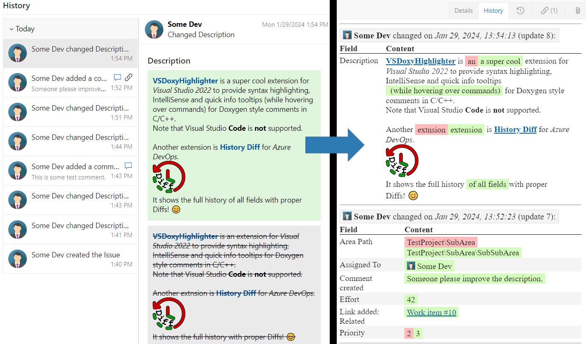

# History Diff <!-- omit in toc -->

The history tab of work items in Azure DevOps shows only the old and new values of each field, without highlighting the actual changes within the field.
This makes spotting the difference very hard for fields that usually contain a lot of text; most prominently, the standard "Description" field and the comments.
This extension adds a **new tab** to work items that shows the full history of every field, while computing an **appropriate diff** for each one.

The left image shows the default Azure DevOps history, while the right depicts the history as shown by the extension:
Changes to the text are much easier to spot.

**For documentation and source code, please head over to the [GitHub page](https://github.com/Sedeniono/ADO-History-Diff).**  
Release notes and alternative vsix-package downloads for each version can be also found [on GitHub](https://github.com/Sedeniono/ADO-History-Diff/releases).
